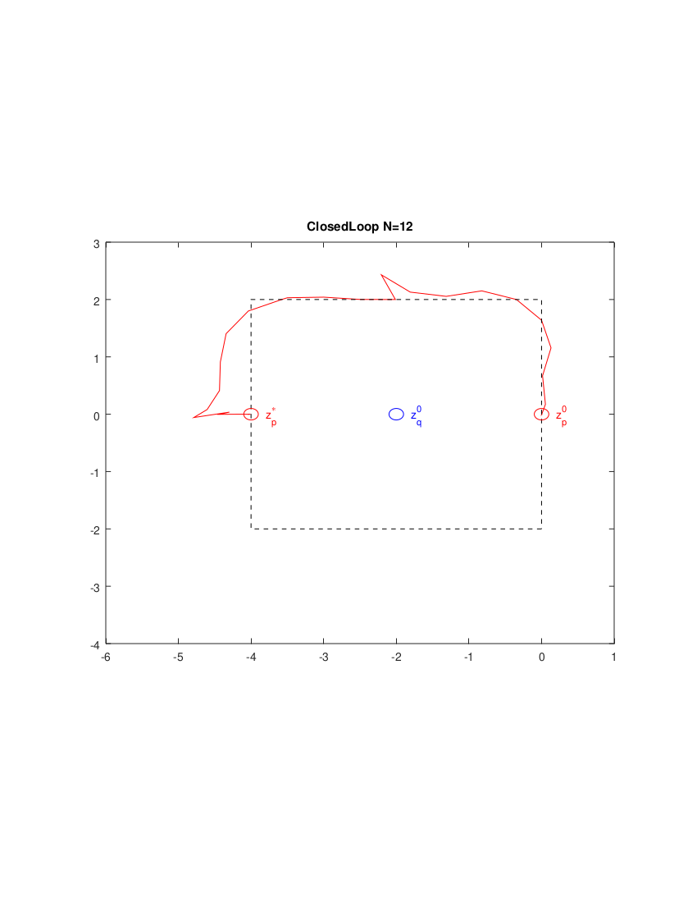

# robotMPCSimulation
A simple robot simulation, which calculates via MPC an optimal trajectory under the given kinematic constraints, which also might include obstacles. The scheme is applied until the target is matched.
The trajectory is given in a textual output and can be plotted, as in the following example for a robot p, circumventing an obstacle (e.g. another robot q):

Start and target position are given as zp(0) and zp*. Robot q is determined to be fixed along the simulation.

This project is licensed under MIT license. If you use this code (also partially), I would appreciate if you would kindly cite in publications or any other usage (commercial or not commercial) by

T. Sprodowski, A Robot MPC Simulation, https://github.com/SirTobias/robotMPCSimulation

Thank you.
